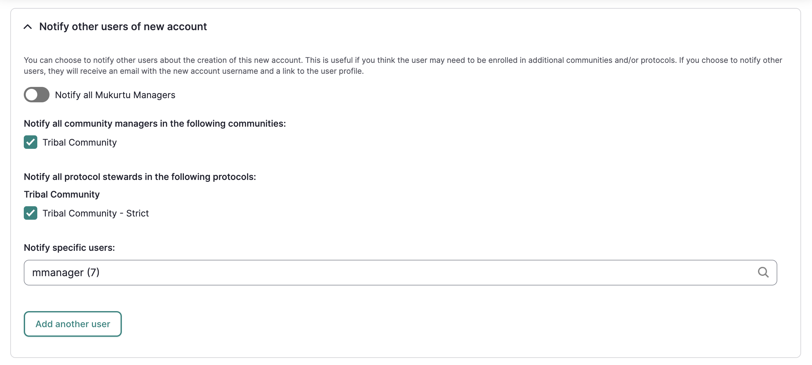
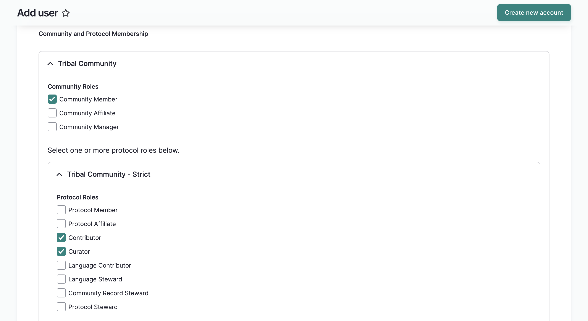

---
tags:
- users
- account management
- getting started
---

# Create User Accounts as a Mukurtu Manager

!!! Roles "User roles" 
    Administrator, Mukurtu manager

This article covers creating a user account from a site-wide role such as an administrator or Mukurtu manager. For information on creating a user account as a community manager, see [Create User Accounts as a Community Manager](../users/create-user-accounts-community-manager.md).

## Create a new user account

There are three ways to access the the add user form to create a new user account:

Method 1: Select the **People** icon from the left-hand menu, then select **Add User** in the top right-hand corner.

Method 2: From the dashboard, in the **Users** section, select **Add User**

Method 3: Append `/admin/people/create` to your URL in your browser's address bar.

### Fill out the add user form

Once the form is open, fill out the form.

1. Add the userʻs email address. 

2. Add a username for the user.

3. Depending on your password settings, the password field may or may not be visible. If for any reason, a password is not entered into this form, the system will auto-generate a password and send a reset link to the user to log in and change their password. If the field is available and you prefer to manually set a password (i.e for security purposes or ease of troubleshooting), you can do so here. For more on password settings, see [Manager User Account Registration](../users/manage-user-account-registration.md).

    

4. You can add an optional display name that differs from their username. This will display if the user leaves comments on content. 

    

5. Select the appropriate status. 
    - **Active** if you want the user to be able to login right away.
    - **Pending** use this status to create the account without activating it. The user will not be able to login. This is helpful if additional set up is required.
    - **Blocked** this status also prevents users from logging in, but is typically used when the user has taken inappropriate action that warrants a temporary loss of access. As we are creating a new user, this status is generally not necessary.

    

6. Select a site-wide role for the user.
    - **Authenticated User** By default, all users are assigned the authenticated user role, and this is the correct setting for the majority of users. Users that have not been assigned to a role can view any pages, browse pages, and community pages under open protocols. Users can create their own personal collections out of existing content.
    - **Roundtrip Manager** Roundtrip managers have access to Mukurtu's import and export tools. These permissions are isolated from other site-level access and tools. Any user can be assigned the Roundtrip manager role and they will be able to import and export metadata and media based on their existing permissions to create and edit content as determined by their role(s) in cultural protocols.
    - **Mukurtu Manager** Mukurtu managers handle most of the site-wide management. They create and manage user accounts, review and approve user account requests, assign site-wide roles, create and delete communities, assign community manager roles, manage taxonomies, and have access to Roundtrip tools for import and export.
    - **Administrator** Administrators have full access to Drupal options (the platform upon which Mukurtu is built). Assign this role with extreme caution. Note that this option is only available to administrators, not Mukurtu managers.

    !!! tip
	    For more information on user roles, see [User Roles](user-role-types.md)

7. To notify other users of this account, expand the **Notify other users of this account** section. Use the toggle/checkboxes to:
    - Notify all Mukurtu managers
    - Notify community managers
    - Notify protocol stewards
    
    You can also notify specific administrators or Mukurtu managers by searching for their username. To notify additional users, select "Add another user."

    

8. If you are also a community manager and protocol steward, you can add new users to those communities and protocols by selecting the role(s) you wish to assign. Skip any groups they should not belong to. If you're unsure about group membership, you can add them to communities and protocols later.

    !!!tip
        For more information on managing group membership, see [Manage Community Members](../communities-cultural-protocols-categories/ManageCommunityMembershipAndRoles.md) and [Manage Protocol Members](../communities-cultural-protocols-categories/ManageProtocolMembershipandRoles.md)

    

9. If your site is multilingual, you can select the site language for the user. Email notifications will be sent in this language, as will the userʻs profile information.

10. Select "Create new account" to create the user account. The form will reload and a success message will be displayed.

    

    !!! Tip
        Users will be able to edit these settings when they log in.

