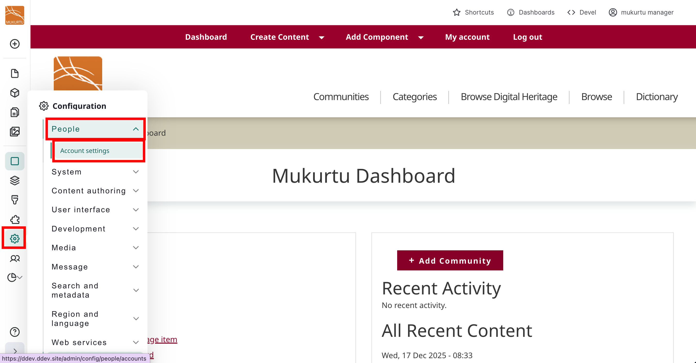
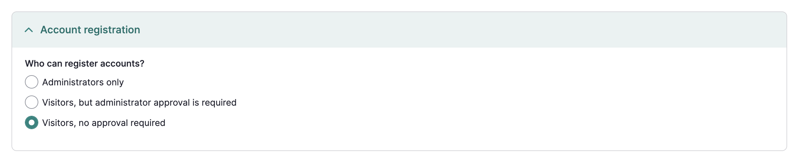
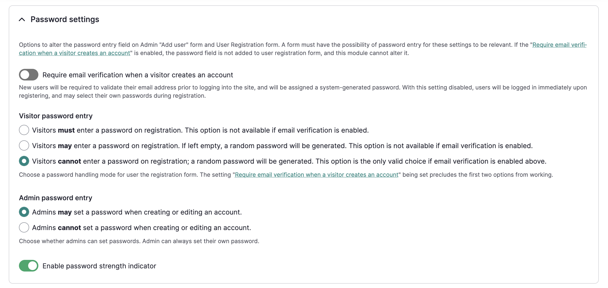
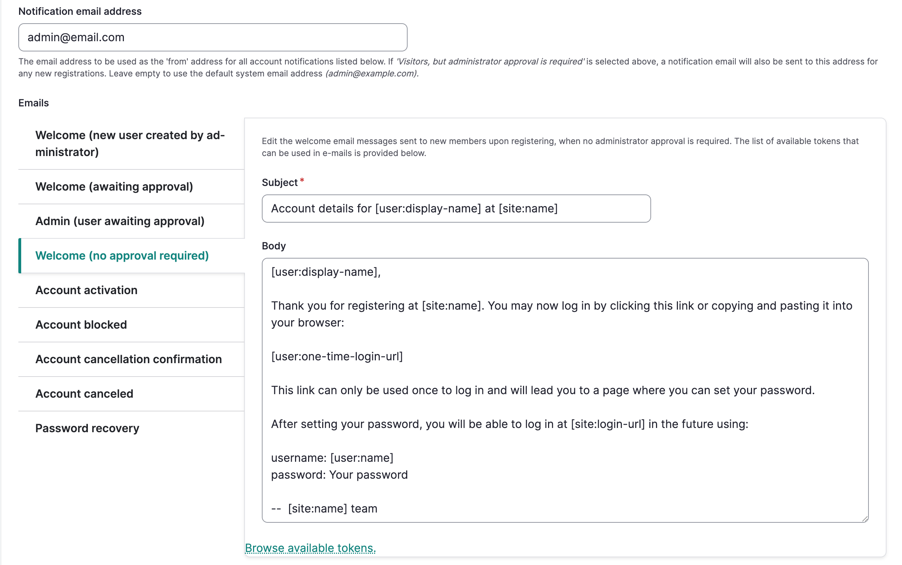
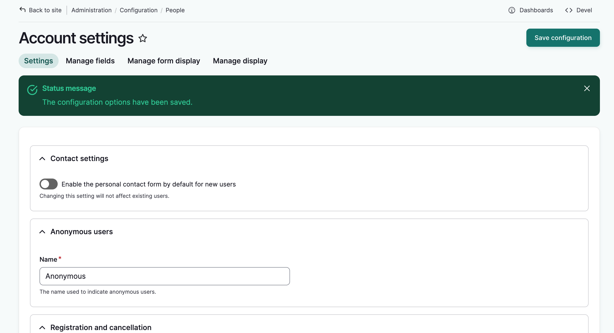

---
tags:
- users
- account management
---

# Manage User Account Registration
!!! Roles "User roles" 
    Administrator, Mukurtu manager

Administrators and Mukurtu managers can edit registration settings for the site. There are two ways to access these settings:

Method 1: Add `/admin/config/people/accounts` to your url in your browser's address bar (i.e. http://mymukurtusite.org/admin/config/people/accounts). 

Method 2: From the dashboard, scroll down to the Users section, and select **Manage User Settings and Registration** 

 

## Account Registration

There are three options in the *Who can register accounts* field that provide varying degrees of control over how new accounts are created. Select the option that best suits your needs. By default, Administrators Only is selected and provides the highest degree of security for your site. 

- Administrators Only: This is the default setting, and it prevents visitors from creating their own accounts. Administrators or Mukurtu managers will have to manually create each user account. This is useful if spam accounts are being made or if you want to control who can make an account on the site. If you choose this setting, we recommend displaying an email address where visitors can request an account. 

- Visitors, but administrator approval is required: This option allows visitors to create an account, but it will be listed as "blocked" until an administrator approves the account and sets it to "active." 

- Visitors: This option allows visitors to create an account without any administrator approval. They can log into the site as soon as their account is made. They won't have any community or protocol membership and can only view public content. In general we DO NOT recommend this setting. 

    

## Password Settings

These settings determine whether the password field displays and how passwords are handled during registration. The account registration settings chosen above determine the options available in password settings. For example, if accounts can only be made by administrators, any settings pertaining to visitors creating their own accounts will be greyed out. 

### Require email verification when a visitor creates an account

Enable this setting to require email verification when a visitor creates an account. This setting is only available if a user cannot create a password upon registration.

### Visitor password entry

This setting determines whether vistor password entry is required, optional, or disabled. 

Select one of:

- Visitors **must** enter a password on registration.This option is not available if email verification is enabled.
The password field will display in the account request form as a required field.

- Visitors **may** enter a password on registration. If left empty, a random password will be generated. This option is not available if email verification is enabled.
The password field will display in the account request form as an optional field.

- Visitors **cannot** enter a password at account request; a random password will be generated. This option is the only valid choice if email verification is enabled above.
The password field will not display in the account request form.

### Admin password entry 

This setting determines whether administrators can set passwords for new users or when editing user accounts. Note that this setting does not apply to an administrator's own account. 

Select one of:

- Admins may set a password when creating or editing an account.
The password field will appear when an admin is creating or editing an account.

- Admins cannot set a password when creating or editing an account.
The password field will not appear when an admin is creating or editing an account.

### Password strength indicator

The password strength indicator visually shows you the strength of your password whether you are setting your password for the first time or resetting it. 

### Account Registration Settings Table
Different settings combinations create different registration flows. The following tables describe those settings and expected results.

|  Who can register accounts? |  Email verification required |  Visitor password entry | Admin password entry  | Result  |
|---|---|---|---|---|
| Administrators Only  | Null  | Null  | Admins may set a password when creating an account | A welcome email is sent to the user with a password reset link that allows them to set their own password.  |
| Administrators Only  | Null  | Null  | Admins cannot set a password when creating an account | A welcome email is sent to the user with a password reset link that allows them to set their own password. |

|  Who can register accounts? |  Email verification required |  Visitor password entry | Admin password entry  | Result  |
|---|---|---|---|---|
| Visitors, but administrator approval is required | Null  | Visitors must enter a password on registration. | NA  |  After admin approval, a welcome email is sent to the user with a password reset link that allows them to set their own password. |
| Visitors, but administrator approval is required | Null  | Visitors may enter a password on registration.   | NA  | **If no password is entered**: After admin approval, a welcome email is sent to the user with a password reset link that allows them to set their own password. **If a password is entered**: After admin approval, a welcome email is sent to the user with a password reset link that allows them to set their own password. Users can also login using the password they set.  |
| Visitors, but administrator approval is required | Null  |  Visitors cannot enter a password on registration | NA  |  After admin approval, a welcome email is sent to the user with a password reset link that allows them to set their own password.  |

|  Who can register accounts? |  Email verification required |  Visitor password entry | Admin password entry  | Result  |
|---|---|---|---|---|
| Visitors, no approval is required | On | Visitors cannot enter a password on registration | NA  |  A welcome email is set to the user with a password reset link that allows them to set their own password.  |
| Visitors, no approval is required | Off  | Visitors cannot enter a password on registration  | NA  | User is logged in and taken to their account page where they can set a password.  |
| Visitors, no approval is required | Off  |  Visitors must enter a password on registration.  | NA  |  The user is logged in. |
| Visitors, no approval is required | Off  | Visitors cannot enter a password on registration | NA  |  User is logged in and taken to their account page where they can set a password. |

## Configure email notifications

1. Use the *Notification Email Address* field to specify an email address for notifications. All automated email messages will be sent from this address. This email will also receive notifications if 'Visitors, but administrator approval required' is selected above. Leave this field blank to use the default system email address.

2. You can customize the automatic email messages that are triggered by registration activities. Select the message you would like to edit and make any desired changes. 

    

    These emails will send by default when the appropriate settings are configured:

    - Welcome - New User Created by administrator - This message is sent when a new member account is created by an administrator.
    - Admin - (User awaiting approval) - This message is sent to administrators when a user creates an account that requires approval.
    - Welcome - (No approval required) - This message is sent when a user creates an account that does not require approval, but does require email verification. 
    - Account Activation (optional - use toggle to turn on/off) - This message is sent to a registered user after an administrator or Mukurtu manager approves an account request. 
    - Account blocked (optional - use toggle to turn on/off) - This message is sent to users when their account is blocked.
    - Account cancellation confirmation - This message is sent to users when they attempt to cancel their accounts.
    - Account cancelled (optional - use toggle to turn on/off) - This message is sent to users when their accounts are cancelled.
    - Password recovery - This message is sent to users who request a new password.

7. When you are finished, select "Save Configuration." The form will reload and a success message will be displayed.

     