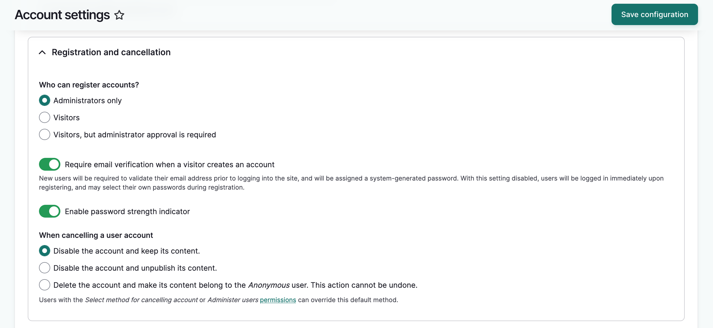
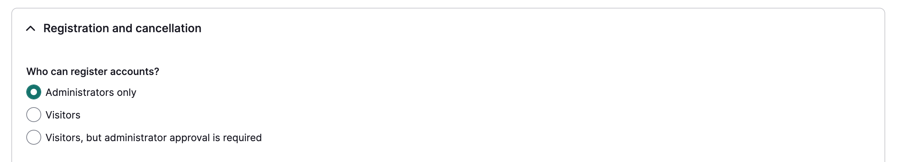
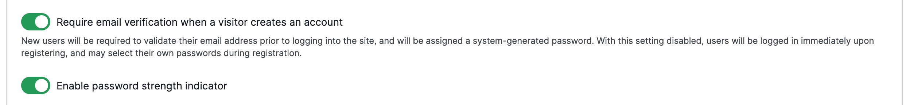
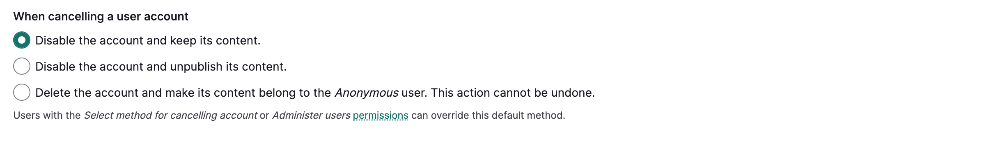
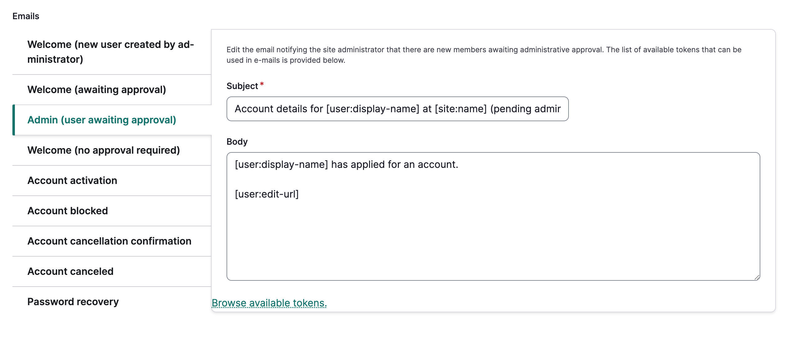

---
tags:
- users
- account management
---

# Manage User Account Registration
!!! Roles "User roles" 
    Administrator, Mukurtu manager

Administrators and Mukurtu managers can edit registration settings for the site. There are two ways to access these settings:

Method 1: Add `/admin/config/people/accounts` to your url in your browser's address bar (i.e. http://mymukurtusite.org/admin/config/people/accounts).

Method 2: Hover over the configuration icon in the left-hand sidebar. Select the **People** sub-menu, then select **account settings**. 

Scroll down to the Registration and cancellation section.

## Registration and Cancellation

3. There are three options in the *Who can register accounts* field that provide varying degrees of control over how new accounts are created. Select the option that best suits your needs. 
    - Administrators Only - This is the default setting, and it prevents visitors from creating their own accounts. Administrators or Mukurtu managers will have to manually create each user account. This is useful if spam accounts are being made or if you want to control who can make an account on the site. If you choose this setting, we recommend displaying an email address where visitors can request an account. 
    - Visitors - This option allows visitors to create an account without any administrator approval. They can log into the site as soon as their account is made. They won't have any community or protocol membership and can only view public content.
    - Visitors, but administrator approval is required - This option allows visitors to create an account, but it will be listed as "blocked" until an administrator approves the account and sets it to "active."
    

4. Use the toggles to enable/disable email verification. This requires new users to validate their email address prior to logging into the site, and will be assigned a system-generated password. With this setting disabled, users will be logged in immediately upon registering, and may select their own passwords during registration.

5. The password strength indicator visually shows you the strength of your password whether you are setting your password for the first time or resetting it. 
    

6. You can set a default selection for cancelling a user account. This can be overridden in the cancellation options when cancelling an account. For more detail see [Manage Users from a Site-wide role](manage-user-accounts-site-wide.md)
    
    The cancellation options are:

	- Disable the account and keep its' content - This blocks the user but keeps their content published. This is selected by default.
	- Disable the account and unpublish its' content - This blocks the user and unpublishes their content.  Administrators can manage the content at `/admin/content.`
	- Delete the account and make its' content belong to the Anonymous User. This action cannot be undone. - This deletes the account. Any content created by the user is assigned to "Anonymous User."
    

## Configure email notifications

6. Use the *Notification Email Address* field to specify an email address for notifications. All automated email messages will be sent from this address. This email will also receive notifications if 'Visitors, but administrator approval required' is selected above. Leave this field blank to use the default system email address.

7. You can customize the automatic email messages that are triggered by registration activities. Select the message you would like to edit and make any desired changes. 
    
    Below are descriptions of each email:
    - Welcome - New User Created by administrator - This message is sent when a new member account is created by an administrator.
    - Welcome - awaiting approval - This message is sent to new users upon registering when administrative approval is required.
    - Admin - (User awaiting approval) - This message is sent when a user creates an account that requires approval.
    - Account Activation (optional - use toggle to turn on/off) - This message is sent to a registered user after an administrator or Mukurtu manager approves an account request. 
    - Account blocked (optional - use toggle to turn on/off) - This message is sent to users when their account is blocked.
    - Account cancellation confirmation - This message is sent to users when they attempt to cancel their accounts.
    - Account cancelled (optional - use toggle to turn on/off) - This message is sent to users when their accounts are cancelled.
    - Password recovery - This message is sent to users who request a new password.

7. When you are finished, select "Save Configuration." The form will reload and a success message will be displayed.
     