---
tags:
- users
- account management
---
# Manage User Accounts and site-wide roles

!!! Roles "User roles" 
    Administrator, Mukurtu manager

## The user management page
Administrators and Mukurtu managers can view and manage all site users. This can be done by appending `/admin/people` to your url (mysite.com/admin/people) or by selecting **People** in the left sidebar menu.

A table lists all site users. Use the search bar at the top of the page to search for individual user accounts by name or email address. The filters allow you to filter by status, site role or community membership. 

The columns display the username, email, status, site role(s) community memberships, the date the account was created, and date and time of last access. 

On the far right, the operations menu contains additional controls that you can apply individually to users. Finally, the bulk action menu at the bottom of the page allows you to apply actions to multiple users at once.

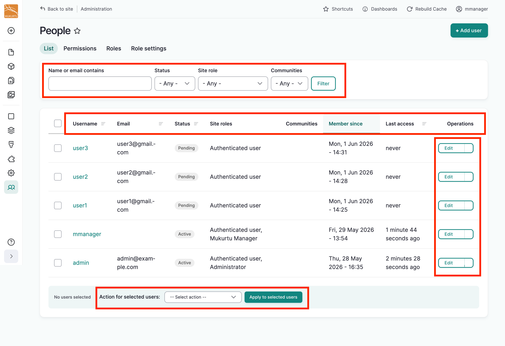

## Managing users individually

To edit a user's account, find their username, and select the **edit** button in their row. 

Make any desired edits and select **Save**. Refer to the [Create a new user account](../users/creating-account-site-wide.md) article for detail on each field.

You will be returned to the user list and a success message will be displayed.

### Operations menu

The operations menu can be exposed by selecting the arrow next to the edit button for each user. It exposes several actions that can be applied to users individually. Continue reading for more detail on each action.

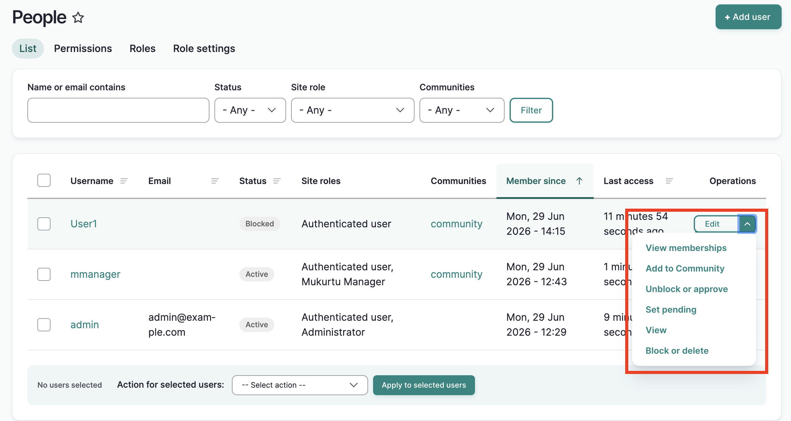

#### View memberships

This allows you to see the communities and protocols to which the user belongs.

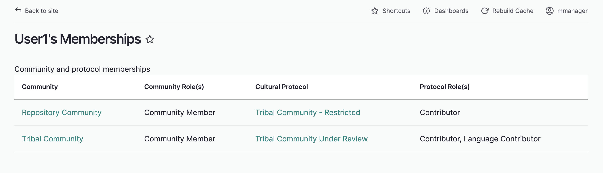

#### Add to community

Mukurtu Managers who also manage communities and protocols can add users to those groups with this option. 

1. For each community to which you would like to add the user, select the role you with to assign, then select "Next: Assign Protocols"
    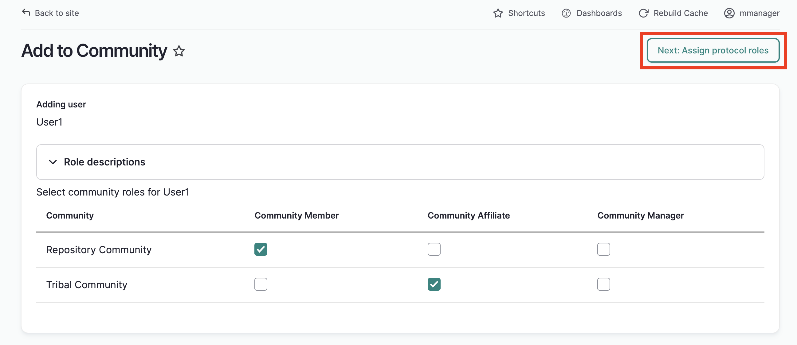

2. On the following page, add users to protocols by selecting the roles you wish to assign to the user for each protocol. If you do not wish to add a user to a particular protocol, do not select any roles. Note that if you are a community manager, but not a protocol steward, you will not be able to add users to protocols.

    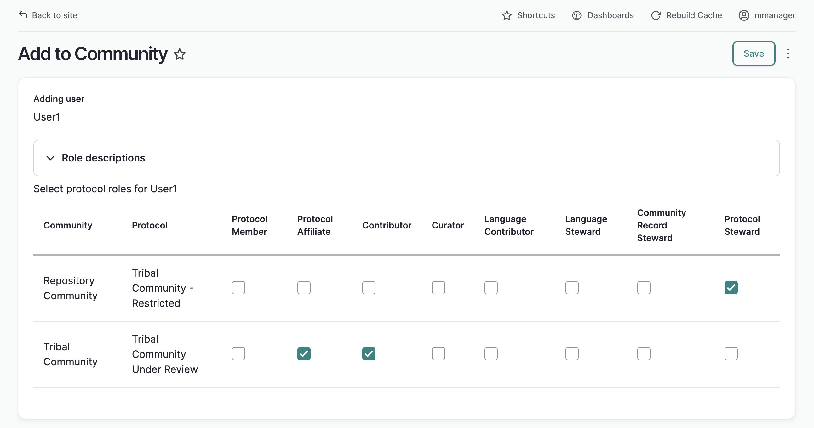

3. Select save. You will be returned to the People page and a success message will display.

#### Unblock or approve

Use this option to unblock blocked users and approve pending users. Their accounts will be set to "acive" and they will be able to login to their account.

#### Set pending

Use this option to set a user account to pending if they require additional approvals. They will not be able to login to their accounts.

#### View

View the user's account page. 

#### Block or delete
This option exposes four additional options for blocking and deleting users:

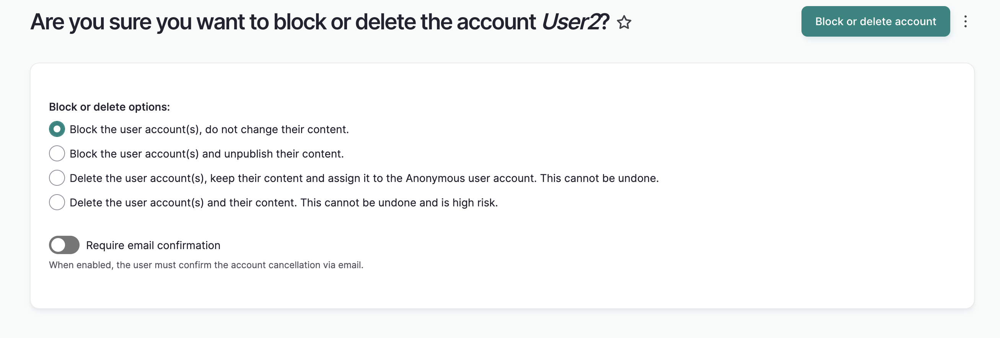

##### Block the user account(s), do not change their content

This option will block the user and keep any content they created available on the site.They will be listed as the creator of the content item. You can unblock the user at any time.

##### Block the user account(s) and unpublish their content.

Blocking the account and unpublishing its content will block the user. Any content they created will be unpublished. Administrators can view this content by adding admin/content to the end of your web address (i.e. http://mysite.org/admin/content). 

You can unblock the user at any time. If their account is restored to "acive," the user will be able to republish their content. They will continue to be listed as the author of the content.

##### Delete the user account(s), keep their content and assign it to the Anonymous user account. This cannot be undone.

This options deletes the user accounts and assigns their content to the Anonymous user account. Should you re-create their account(s), you will not be able to reassign their content to them.

##### Delete the user account(s) and their content. This cannot be undone and is high risk.

This option deletes the user account(s) and all of their content. This cannot be undone. User with extreme caution.

## Bulk manage user accounts
You can apply several actions to users in bulk using the bulk action menu at the bottom of other page:

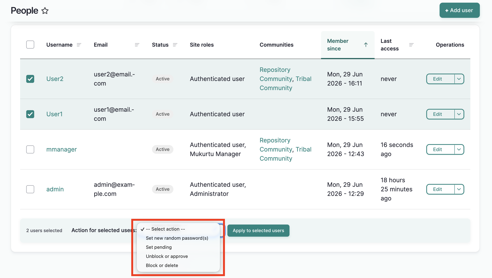

1. To use any of these actions on one or more users, check the box next to each name you wish to manage. 

2. Using the action menu at the bottom of the page, select the action you wish to apply. 

3. Select **Apply to selected items**. The action will be applied to all selected users.

4. You will receive different results depending on the action item you select. Below are descriptions of the results of applying steps 1-3 above for each action item, and any additional instructions as needed.

### Set new random passwords for users.
1. Complete steps 1-3.

    

2. An email with a password reset link will be sent to the users.
    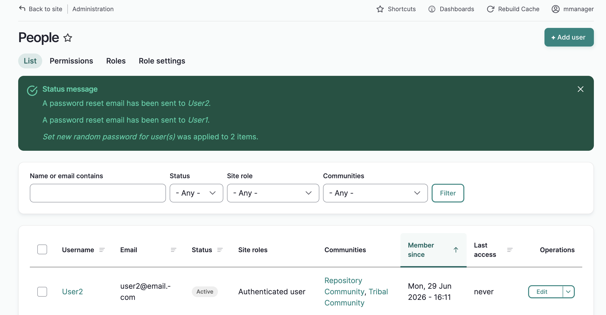

### Set pending
1. Complete steps 1-3.

    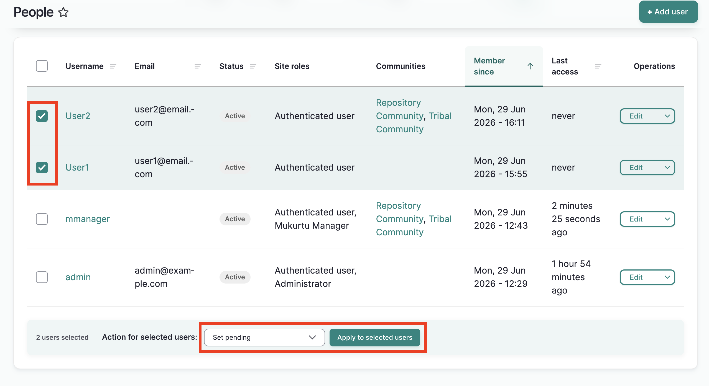

2. A success message displays. The user accounts are set to pending and they will be unable to log in.

    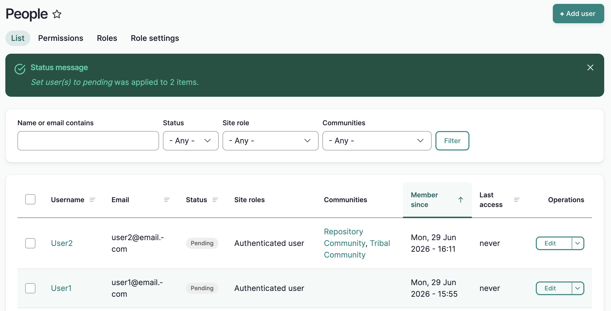

### Unblock or approve
1. Complete steps 1-3.

    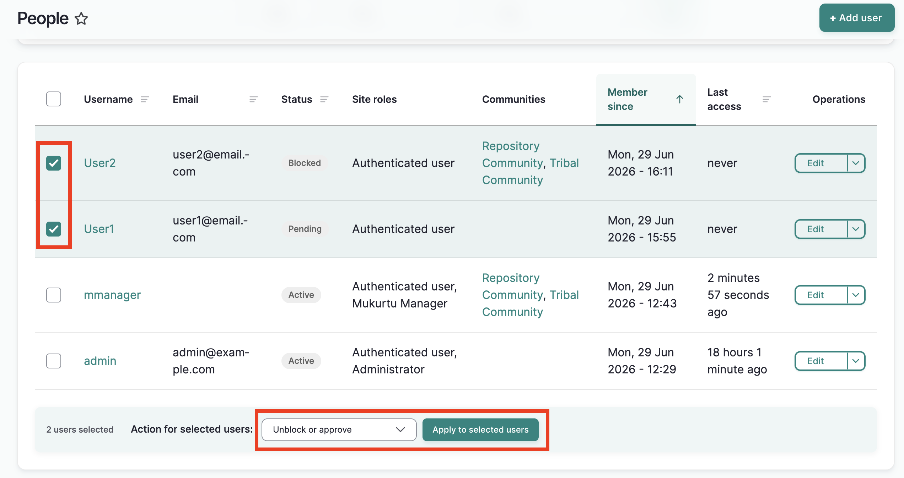

2. A success message displays. The user accounts are set to active and they will be able to log in.

    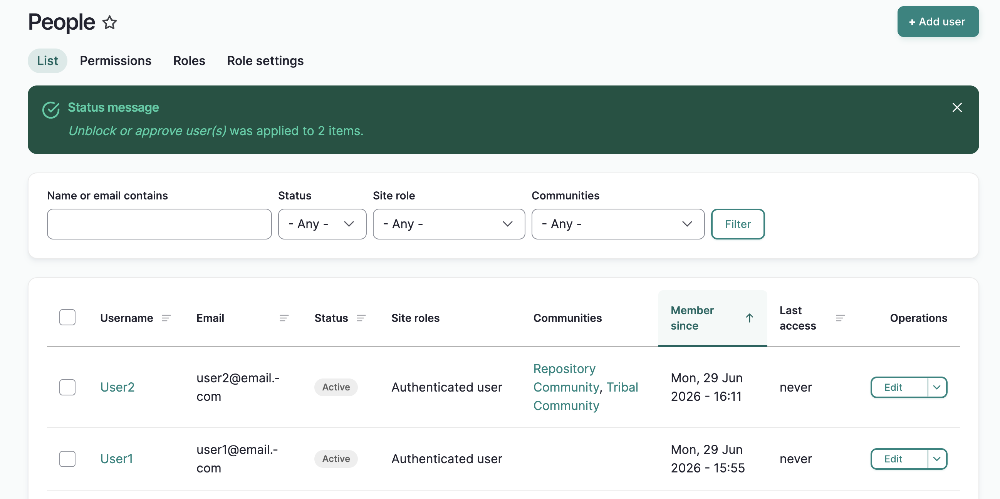

### Block or delete
There are several options for blocking and deleting accounts. Refer to [Block and delete](#block-or-delete) above for descriptions of each option.

1. Complete steps 1-3

    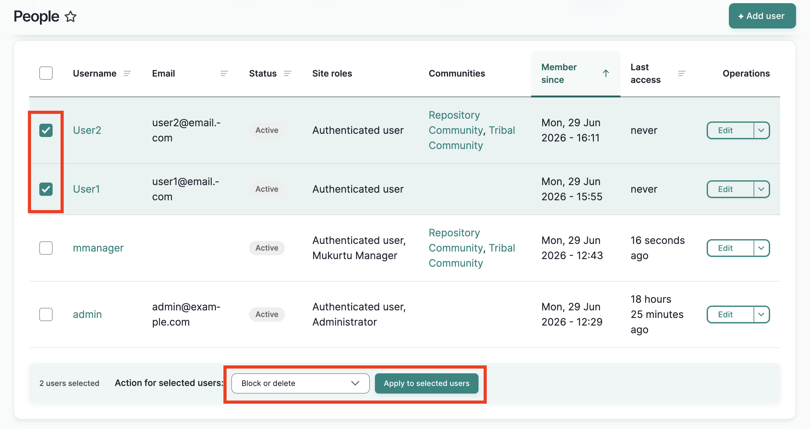

2. On the following page, select one of the following:
    
    - Block the user account(s), do not change their content

    - Block the user account(s) and unpublish their content.

    - Delete the user account(s), keep their content and assign it to the Anonymous user account. This cannot be undone.

    - Delete the user account(s) and their content. This cannot be undone and is high risk.

See [Block or Delete](#block-or-delete) for detailed explanations of each option. 

