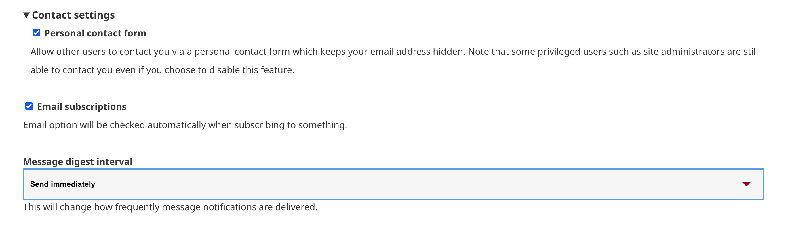

---
tags:
- users
- account management
---

# Request an Account

!!! Roles "User roles" 
    Visitor

As a visitor to a Mukurtu site, you may be allowed to create an account yourself from the log in page. Creating an account may allow you login access right away, or it may require administrative approval. Note that this feature may not be enabled. If this is the case, contact the site adminstrator to request an account.

1) From the homepage, select "Log in" in the main menu.

2) Select "Create new account". If you do not see this option, contact the site administrator to request an account.

3) A registration form will open. Enter your email address and desired username.

4) Enter an optional display name. This will display in comments on content, and may be useful if your usename does not easily identify you and you would like to be identified on the site.

5) You can choose to have users contact you via a personal contact form which hides your email. If you leave this option unselected, other users will unable to contact you through the site. This does not apply to administrators or Mukurtu managers, who will still be able to contact you.

6) Checking the *email subscriptions* box will automatically check the emails box when subscribing to receive notifications on the site. For example, you could sign up to receive notifications whenever new content is added to a protocol. Notification subscriptions is a feature we plan to implement in future development.

7) Select a message digest interval:

- Daily - receive a digest of email updates once per day.
- Immediately - receive email updates immediately.
- Weekly - receive a digest of updates weekly.

    

8) When you are finished, select "Create new account." The home page will reload with a success message. If the site allows you to create an account without administrative approval, you will be able to log in immediately. If approval is required, your account will be blocked until it is approved and set to active. 

