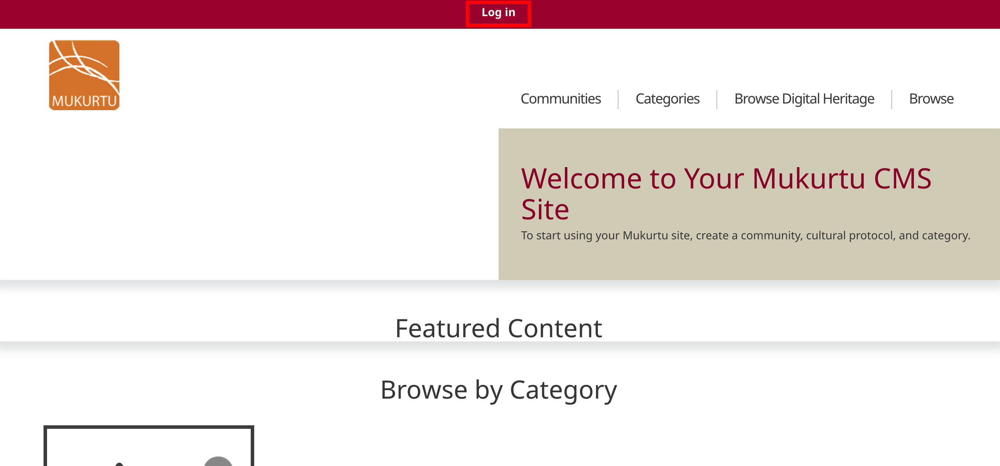
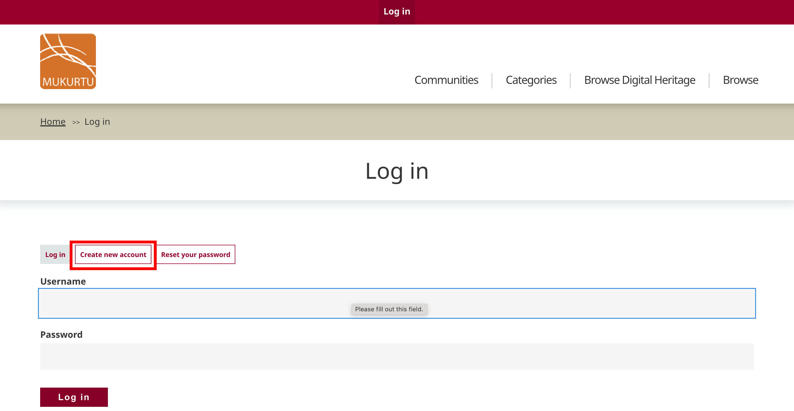
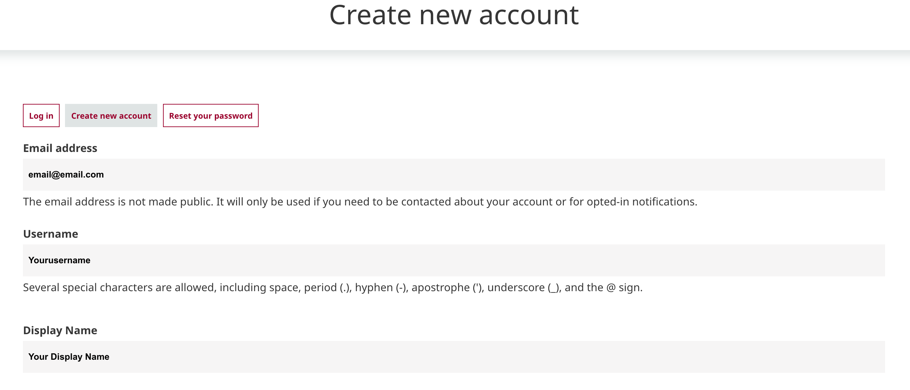
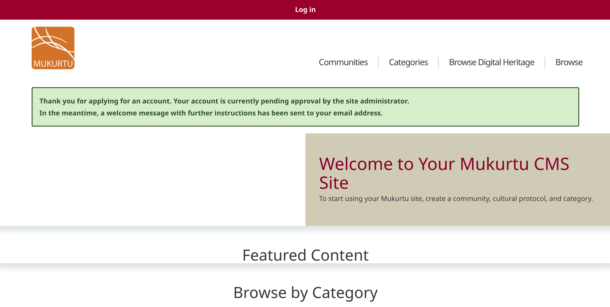

---
tags:
- users
- account management
---

# Request an Account

!!! Roles "User roles" 
    Visitor

As a visitor to a Mukurtu site, you may be allowed to create an account yourself from the log in page. Creating an account may allow you login access right away, or it may require administrative approval. Note that this feature may not be enabled. If this is the case, contact the site adminstrator to request an account.

1) From the homepage, select "Log in" in the main menu.

2) Select "Request new account". If you do not see this option, contact the site administrator to request an account.

3) A registration form will open. Enter your email address and desired username.

4) When you are finished, select "Request new account".

5) The form will reload with a success message. If the site allows you to create an account without administrative approval, you will be able to log in immediately. If approval is required, your account will be blocked until it is approved and set to active. 

