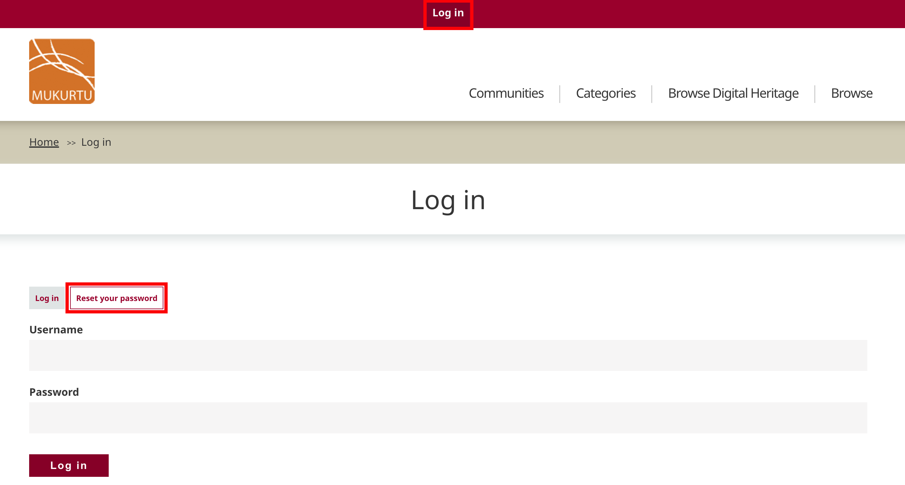
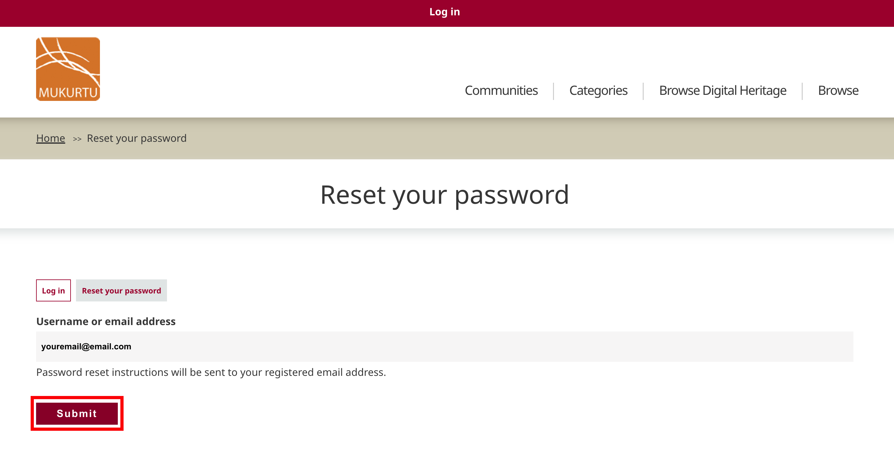
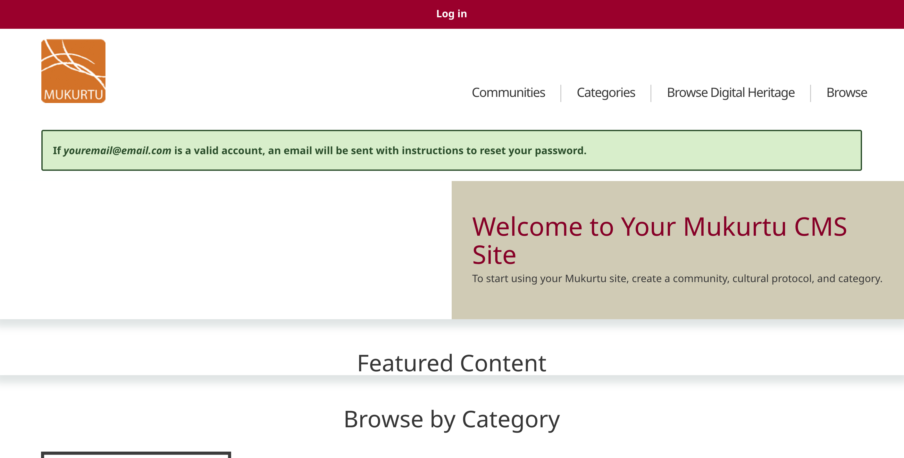

---
tags:
- users
- account management
---

# Reset Your Password
!!! Roles "User roles" 
    Authenticated user

1. On the log in page, Select "Reset your password"

2. Enter your username or email address and select "submit"

3. The homepage will load and display a success message. Password reset instructions will be sent to your email address.
