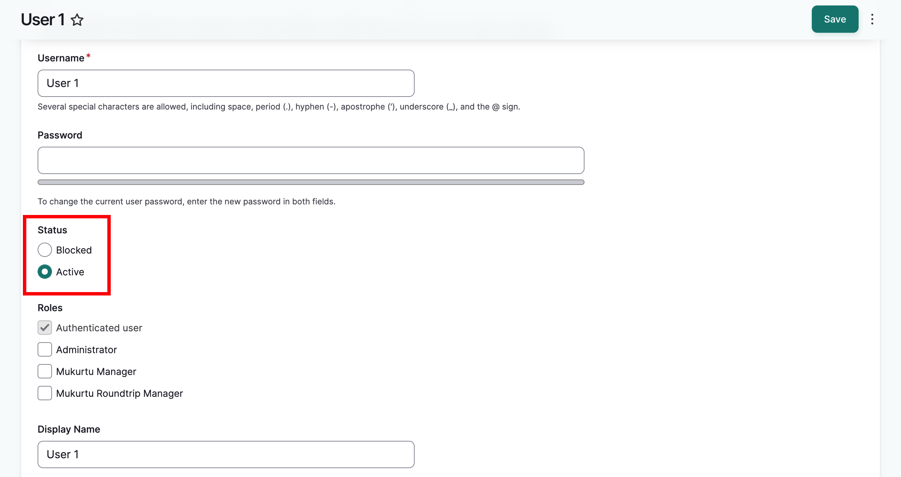
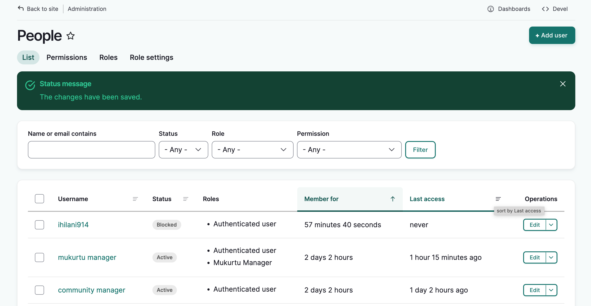
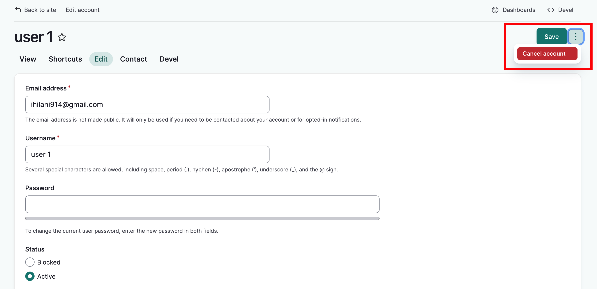
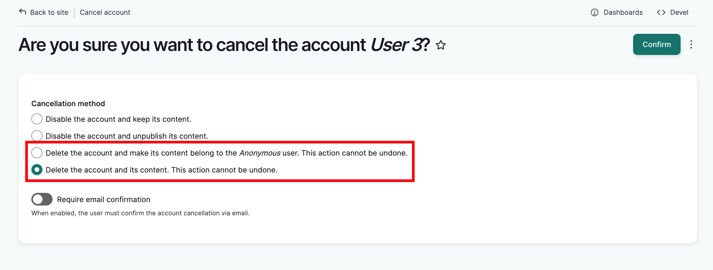
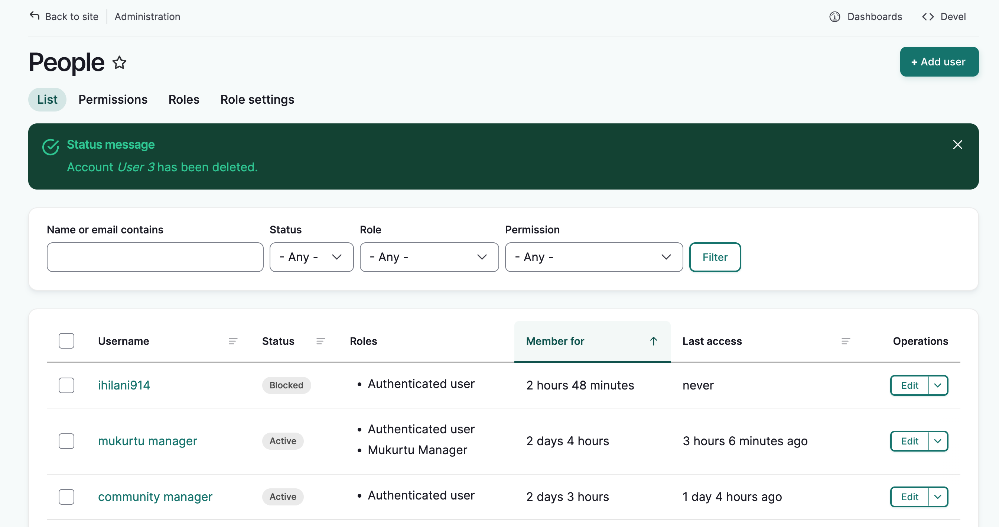

---
tags:
- users
- account management
---

# Review User Account Requests
!!! Roles
    Administrator, Mukurtu manager

When a visitor creates a new account, if they are required to have administrative approval, an email will be sent to the default system email address, or to the email specified in account settings (for more on account settings, see [Manage User Account Registration](../users/manage-user-account-registration.md))

When you receive an account request in your email inbox, select the link included in the email. It will take you to the user's edit page. Here you will see all the account settings selected by the user when they created the account request.

## Approve an account request
To approve the account, set the status from "Blocked" to "Active" and select "Save". 

You will be returned to the people page and a success message will be displayed. 

If you have enabled email notifications for account approvals, the user will receive an email confirmation message. This can be configured in the account settings page. See [Manage User Account Registration](../users/manage-user-account-registration.md) for details.

## Cancel an account request
If you do not wish to approve the account, you can leave it in its current "blocked" state. The account will remain, but the user will be blocked and unable to log in.

To delete the account completely, select "more actions menu" (the three dots next to the "Save" button) and select "cancel account".

A secondary page will prompt you to select a cancellation method. You can read about them in greater detail at [Manage User Accounts from a Site-wide Role](../users/manage-user-accounts-site-wide.md), but as this is a new account request, the user won't have any content on the site. 

Select either "Delete the account and make its content belong to the Anonymous user" or "Delete the account and its content". Then select "Confirm."

The people page will load wtih a success message. The user's account will be deleted.
